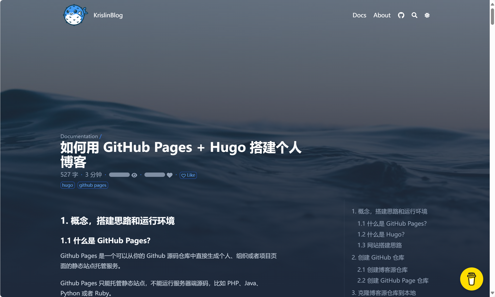

 **编辑于2024年11月03日**
 
# 前言

因为感觉自己需要一个平台来记录一些技术博客，所以寻找了一些开源博客平台，一开始选择的是suiyan，因为其生成的html排版和vscode、marktext的预览都不同，只能放弃。*[suiyan项目地址](https://github.com/bosichong/suiyan)* 

然后看到了使用hugo的[blowfish主题的一篇博客](https://krislinzhao.github.io/docs/create-a-wesite-using-github-pages-and-hugo)，感觉很不错，就开始用hugo，但奈何这个主题我一直调不出来，😂😂，又放弃了。不过这次我又找到了hugo上面的[diary主题](https://github.com/amazingrise/hugo-theme-diary)，这次一路磕磕碰碰，勉强搞定了，所以记录一下。  

---

# 使用suiyan（已放弃）

suiyan项目是在公众号看到的，直接git clone下来，然后运行`python -m venv env`来创建虚拟环境（甚至这时候创建虚拟环境已经忘了，还是去百度的），然后就是熟悉的`pip install -r requirment.txt`，接着运行`w.py`即可。甚至还有窗口GUI，感觉对我这种新手很良好。

本来体验挺不错的，但是它的md格式解析好像和vscode、marktext不一样，多级列表没有正确解析成html。这我就没办法了，只能放弃。（也许会去仓库提一下issue？）  

---

# 使用hugo

## 尝试blowfish（又放弃了😂）

这个是我直接搜**github blog**，搜出来一篇介绍hugo+github pages的博客*就是参考的第一个链接*。其实这个博客的主题风格我感觉挺喜欢的，所以马上入坑了。

  

然后我就安装了Hugo，其实只要去winget安装就行，注意要安装extended（扩展版），因为扩展版才支持modules，而这个主题是需要modules的。

但是我按照上面那篇博客进行搭建，却不能正常运行，跑不起来。然后我就去看了主题的toml，发现它支持的最高hugo版本是`0.135.0`，但是我安装的是最新版`0.136.5`。于是我就卸载最新版，（不知道为什么，执行`winget uninstall --id Hugo.Hugo.Extended`不行，要执行`winget uninstall --name "Hugo(扩展版)"`），安装`0.135.0`版本。

结果还是不行，所以懒得折腾了，放弃😂。

## 接触并使用diary

这个则是我随意逛hugo的主题展览页时挑中的其中一个，只有它符合：
1. 有目录
2. 风格简洁淡雅

其它的都不太符合我的要求，所以我就相中它了，下面是我的搭建过程：

### 搭建过程

先在一个目录下新建一个hugo站点：

```sh
hugo new site BlogSite
```

然后通过git拉主题文件下来：

```sh
git submodule add https://github.com/AmazingRise/hugo-theme-diary.git themes/diary
```

等下载完之后，就将主题里面一些文件夹拷贝到hugo的站点下：

```
/exampleSite/*
/archetypes
```

然后将站点根目录的`hugo.toml`删除，复制出来的那个`config.toml`改名`hugo.toml`。

此时就可以在当前目录运行本地服务测试命令：

```sh
hugo server
```

没问题就完成这一部分了。

### 修一些bug

那个新的`hugo.toml`里面有个bug，我当时排除了半天😓。文件尾部的定义侧边栏的命名漏了一个字母，导致和模板文件对不上。

bug就是下面的`[[menus.main]]`，改之前是`[[menu.main]]`，模板文件里是`site.Munus.main`😓。~~也许我会去提一下issue😋~~

而且我一开始是不知道要把`config.toml`改名`hugo.toml`，因为只有`hugo.toml`才支持定义列表，可能是`config.toml`太老版本了吧，好像从`0.110.0`起就改用`hugo.toml`。

修改之后的`hugo.toml`尾部：

```toml
[[menus.main]]
url = "/categories"
name = "分类 Categories"
weight = 1
[[menus.main]]
url = "/tags"
name = "标签 Tags"
weight = 2
[[menus.main]]
url = "/posts"
name = "归档 Archive"
weight = 1
[[menus.main]]
url = "/index.xml"
name = "RSS"
weight = 3
```

---

# 托管到Github pages

过程十分滴简单，先在GitHub新建一个仓库，名称一定要是`你的用户名.github.io`，比如我的就是`hxxxer.github.io`，记得选择公开和新建readme文档（为了在远程建立main分支）。

然后在hugo项目根目录的`pulic`文件夹下新建仓库，连接远程仓库，拉取，添加，推送：

```sh
git init -b main
git remote add origin-when-cross-origin xxx@github.com:xxx
git pull --rebase origin main
git add .
git commit -m ""
git push origin main
```

然后完了。以后就直接`add` `commit` `push`就行。

# 参考
---
> [使用Hugo + blowfish搭建博客及Github Pages](https://krislinzhao.github.io/docs/create-a-wesite-using-github-pages-and-hugo)
>
> [使用 Hugo + Github Pages 部署个人博客](https://ratmomo.github.io/p/2024/06/%E4%BD%BF%E7%94%A8-hugo--github-pages-%E9%83%A8%E7%BD%B2%E4%B8%AA%E4%BA%BA%E5%8D%9A%E5%AE%A2/)
>
> [python使用自带的venv创建虚拟环境](https://docs.python.org/zh-cn/3/library/venv.html)