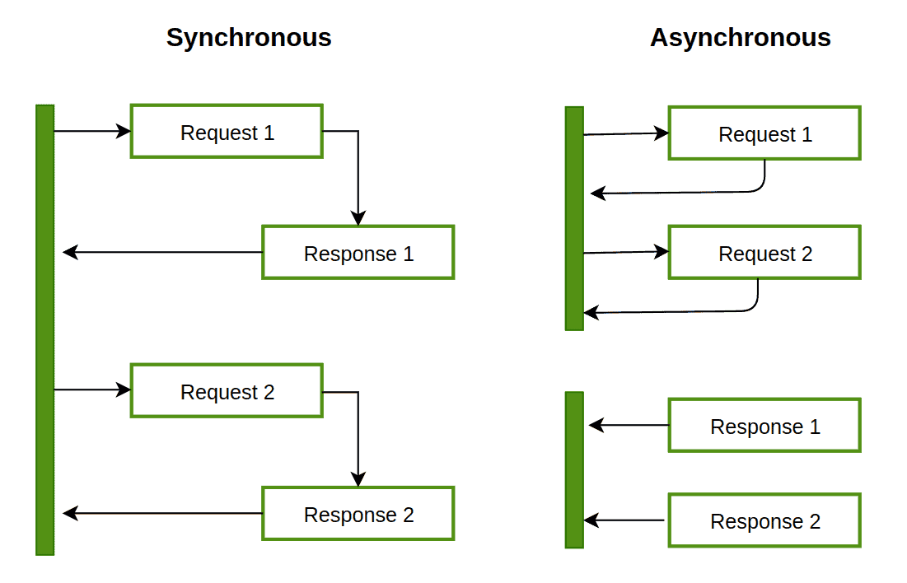

**最后编辑于2024年11月05日**

# 前言

在编用于hugo的.NET桌面程序时，需要在启动服务时，禁用更新静态网页文件，在问千问时，它使用了异步编程：将开启服务函数定义为异步，并在`await Task.Run(() => process.WaitForExit());`后，`otherBotton_Click = true;`。一下子唤起了我了解异步编程的兴趣。

其实我之前已经多次了解甚至使用过了，但是还是不能说是学会，现在凭借AI的力量，简单地记录一下学习过程。

---

# AI和我的问答

## 问答一

有关异步编程，我可以这么理解吗

一个异步函数执行时是独立于主程序之外，其执行时不影响主程序，把异步函数和主程序看成两条独立的执行线，在它们内部，异步函数和主程序仍然是同步阻塞的

你的理解大体上是正确的，但需要进一步澄清一些细节，以便更准确地理解异步编程的概念。

### 异步编程的基本概念

1. **非阻塞性**：异步操作的一个主要特点是它们不会阻塞主线程。这意味着当一个异步任务启动后，程序不会等待这个任务完成，而是继续执行后续的代码。一旦异步任务完成，通常会通过回调函数、事件、或者Future/Promise等机制通知主线程。

2. **并发与并行**：
   - **并发**（Concurrency）是指多个任务可以交替执行，即使在单核CPU上也可以通过快速切换上下文来实现。
   - **并行**（Parallelism）是指多个任务可以同时执行，这通常需要多核CPU的支持。
  
  
3. **执行模型**：在异步编程中，虽然异步任务看起来像是独立运行的，但实际上它们可能是在同一个线程中通过事件循环（Event Loop）来管理的。例如，在JavaScript的Node.js环境中，大多数I/O操作都是异步的，并且是非阻塞的，这是因为它们利用了底层的操作系统特性来处理I/O请求，而不需要阻塞主线程。

### 你的理解中的几点说明

- **独立于主程序**：异步函数确实可以在一定程度上独立于主程序执行，但这并不意味着它们完全独立。实际上，异步函数的执行通常依赖于事件循环或者其他调度机制。这意味着异步任务的执行时机是由系统决定的，而不是立即执行。

- **不影响主程序**：正确。异步函数执行时，主程序可以继续执行其他任务，不会因为等待异步任务完成而阻塞。

- **两条独立的执行线**：这个说法有些误导。虽然从逻辑上看，异步函数和主程序似乎是两条独立的执行线，但在实际实现中，它们可能共享同一个线程。例如，在Node.js中，所有的异步I/O操作都是在同一个线程上通过事件循环来管理的。

- **内部仍然是同步阻塞的**：这一点需要具体情境来看。在异步函数内部，如果它执行的是纯计算任务（例如复杂的数学运算），那么这部分确实是同步阻塞的。但如果异步函数涉及I/O操作或其他耗时任务，这些操作本身通常是通过操作系统或其他库异步处理的，因此不会阻塞异步函数的执行。

### 示例

假设你有一个异步函数来读取文件：

```cpp
#include <iostream>
#include <fstream>
#include <future>

std::future<std::string> readFileAsync(const std::string& filename) {
    return std::async(std::launch::async, [filename] {
        std::ifstream file(filename);
        std::string content((std::istreambuf_iterator<char>(file)),
                            (std::istreambuf_iterator<char>()));
        return content;
    });
}

int main() {
    auto future = readFileAsync("example.txt");

    // 主程序继续执行其他任务
    std::cout << "Doing other work..." << std::endl;

    // 等待异步任务完成
    std::string content = future.get();
    std::cout << "File content: " << content << std::endl;

    return 0;
}
```

在这个例子中，`readFileAsync` 是一个异步函数，它使用 `std::async` 来启动一个新线程读取文件。主程序在启动异步任务后继续执行其他任务，直到需要文件内容时才调用 `future.get()` 阻塞等待结果。

## 问答二

那我这样理解可不可以

异步函数在主程序之外执行，当主程序需要结果的时候就调用await之类的，调用时异步函数可以看成其回到主程序的执行线上，可能会阻塞主程序。

你的理解基本是正确的，但有一些细节需要注意。让我们进一步澄清一下：

### 异步函数的执行

1. **异步函数在主程序之外执行**：
   - **部分正确**：异步函数确实可以在主程序之外执行，但这取决于具体的实现方式。在某些情况下，异步函数可能在另一个线程或进程中执行（例如使用 `std::async` 或多线程库）。而在其他情况下，异步函数可能在同一线程内通过事件循环（例如在Node.js中）执行。


2. **当主程序需要结果的时候就调用 `await` 之类的**：
   - **正确**：当你在主程序中使用 `await` 关键字（或类似的机制，如 `std::future::get`）来获取异步函数的结果时，主程序会暂停执行，等待异步任务完成。这是为了确保你可以在主程序中安全地使用异步任务的结果。


3. **调用时异步函数可以看成其回到主程序的执行线上，可能会阻塞主程序**：
   - **部分正确**：当你使用 `await` 或类似的方法获取异步任务的结果时，主程序确实会暂停执行，等待异步任务完成。这种暂停可以被视为一种“阻塞”，但这种阻塞是局部的，仅限于当前的同步上下文。在异步任务完成之前，主程序的其他部分仍然可以继续执行其他任务。

### 详细解释

- **异步任务的执行**：
  - **多线程**：如果异步任务在另一个线程中执行（例如使用 `std::async`），那么它确实是独立于主程序的线程。主程序可以在等待结果时继续执行其他任务。
  - **事件循环**：如果异步任务在同一个线程中通过事件循环执行（例如在Node.js中），那么它会在事件循环的控制下异步执行。主程序可以在等待结果时继续处理其他事件。


- **获取结果**：
  - **`await` 关键字**：在支持 `await` 的语言（如C#、JavaScript）中，`await` 会暂停当前的同步上下文，等待异步任务完成。在这期间，主程序的其他部分仍然可以继续执行其他任务。
  - **`std::future::get` 方法**：在C++中，`std::future::get` 会阻塞当前线程，直到异步任务完成。这意味着当前线程会暂停，但其他线程仍然可以继续执行。

### 示例

假设我们使用C++的 `std::async` 和 `std::future` 来实现一个异步任务：

```cpp
#include <iostream>
#include <future>
#include <thread>
#include <chrono>

int asyncTask() {
    std::this_thread::sleep_for(std::chrono::seconds(2)); // 模拟耗时操作
    return 42;
}

int main() {
    std::future<int> result = std::async(std::launch::async, asyncTask);

    // 主程序继续执行其他任务
    std::cout << "Doing other work..." << std::endl;
    std::this_thread::sleep_for(std::chrono::seconds(1));
    std::cout << "Still doing other work..." << std::endl;

    // 获取异步任务的结果，可能会阻塞主程序
    int value = result.get();
    std::cout << "Async task result: " << value << std::endl;

    return 0;
}
```

在这个例子中：

1. `asyncTask` 是一个异步任务，它在另一个线程中执行。
2. 主程序在启动异步任务后继续执行其他任务。
3. 当主程序调用 `result.get()` 时，它会阻塞当前线程，等待异步任务完成。

### 总结

- 异步函数可以在主程序之外执行，具体取决于实现方式。
- 当主程序需要结果时，可以使用 `await` 或类似的方法来获取结果，这会暂时阻塞当前的同步上下文。
- 在等待结果期间，主程序的其他部分仍然可以继续执行其他任务。

---

# 最后我的理解

其实关于异步编程在很多情况都不需要了解底层原理，只需要知道怎么用就行，所以我觉得用执行线来理解也是可以的。

主程序是一条主线，调用了一个异步函数就相当于新开了一条执行线，可能是并行（多进程），也可能是并发（不停切换），直到`await`之类的之前，异步执行线和主程序各自运行。等到主程序，或者其它执行线叫了异步执行线，那么这个异步执行线就加入到叫它的执行线上，阻塞这个执行线，直到有结果了。

下面是一张感觉有的点合适的网图：

