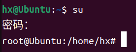
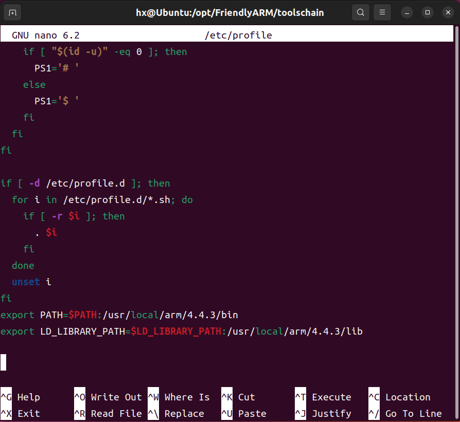
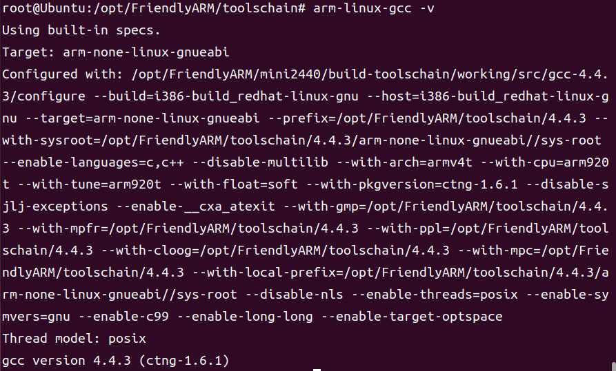

"mini2440的交叉编译环境搭建"
date: 2024-11-05T02:27:17+08:00
description: "在虚拟机Ubuntu上搭建mini2440的交叉编译环境（arm-linux-gcc）"
tags: ["mini2440", "环境搭建"]
featured_image: ""
# images is optional, but needed for showing Twitter Card
images: []
categories: "课程学习"
comment: true
---

**最后编辑于2024年11月05日**

# 前言

c语言编写的代码需要编译才能运行，在电脑的amd64架构就是使用`gcc`来编译。如果想要编译成板子能运行的文件，就需要适配板子的arm架构的编译工具，也就是`arm-linux-gcc`，因为和电脑的不同，也叫做交叉编译。

下面就是我的交叉编译环境的搭建。（因为这篇Blog是在我搭建完成之后写的，可能会有所错漏，文章的尾部添加了评论功能，不过要登录Github）

---

# 我的环境配置

- win11 64位，21H2，专业版
- 虚拟机平台为Oracle VM VirtualBox（VBox），安装映像为Ubuntu 22.04.5

---

# 配置前准备

## 交叉编译工具

就资料里面那个`arm-linux-gcc-4.4.3.tar.gz`，路径是`\FriendlyARM-2440-DVD\Linux\arm-linux-gcc-4.4.3.tar.gz`。

## 虚拟机配置

虚拟机平台可以选择VMware，也可以和我一样。系统就Ubuntu，版本选择LTS版的20、22、24应该都可以。

打开虚拟机，先确保你可以获取root权限。摁`Ctrl+Alt+T`打开终端，输入`su`，然后输入密码（看不到但确实在输入），可能是你的开机密码。如果不是，可以百度（你的虚拟机平台）root账户，之类的。因为有的虚拟机平台会新建一个root账户，我的就是。



---

# 开始搭建环境

以下内容均参考一篇CDSN博客[^1]，命令均在root权限下执行。

## 解压文件

首先通过共享文件夹或者拖文件等方法，将`arm-linux-gcc-4.4.3.tar.gz`复制到虚拟机内，并在当前文件夹打开终端，执行解压指令。

```
sudo tar xvzf arm-linux-gcc-4.4.3.tar.gz -C/
```

执行完成之后会将压缩文件解压到`/opt/`内，可以使用`cd`和`ls`命令去看一下。下面是文件夹树, 我们主要需要的就是文件夹`4.4.3`。

```
|opt
|-- FriendlyARM
|   `-- toolschain
|       `-- 4.4.3
|.......
```

## 复制交叉编译工具到arm

然后在`/usr/local/`下新建一个文件夹`arm`，并给权限。

```sh
sudo mkdir /usr/local/arm
sudo chmod 777 /usr/local/arm
```

然后将文件夹`4.4.3`复制到`arm`文件夹。

```sh
cd /opt/FriendlyARM/toolschain/
sudo cp -r 4.4.3 /usr/local/arm
```

## 配置环境变量

环境变量是写在`/etc/profile`里面，所以下面的操作可以在终端执行，也可以用文本编辑器。

终端命令：

```sh
sudo nano /etc/profile
```

然后在文件尾部添加两行：

```sh
export PATH=$PATH:/usr/local/arm/4.4.3/bin
export LD_LIBRARY_PATH=$LD_LIBRARY_PATH:/usr/local/arm/4.4.3/lib
```



添加完之后，使用source命令重新加载配置文件：

```sh
source /etc/profile
```

执行完后终端不会有什么输出，以防万一可以重启。

---

# 安装缺失的库

在执行完上面的操作之后，理论上`arm-linux-gcc`就安装完成了，但是事实上还没完，因为这个交叉编译工具非常老，是为32位系统做的，而现在的系统基本都是64位，所以需要补装一些32位的库。

由于我的虚拟机已经安装好了，所以无法复现，但是可以根据报错来安装缺失的32位库。先在终端输入命令检测版本，如果没有库是缺失的话，是可以正常输出的。

```sh
arm-linux-gcc -v
```



如果没有安装好32位的库，就会报错（下面不是原始的报错，是我网上找到报错信息的重点，但格式相差不大）：

```sh
error while loading shared libraries: libstdc++.so.6: cannot open shared object file: No such file or directory
```

重点是**libstdc++.so.6**，根据这个来安装合适的32位版本的库，以防万一，64位也一起安装（其实一般64位版本是预安装的）：

```sh
sudo apt-get install libstdc++6
sudo apt-get install lib32stdc++6
```

可以看到32位就是在`lib`后面加`32`。

如果安装失败，可以拿报错去百度搜一下。

接下来就是不断重复`arm-linux-gcc -v`、看报错、`sudo apt-get install lib...`、`sudo apt-get install lib32...`，直至看到正常输出了。

# 参考

---
[^1]: [【嵌入式】Linux开发工具arm-linux-gcc安装及使用](https://blog.csdn.net/weixin_43734095/article/details/104941659)
