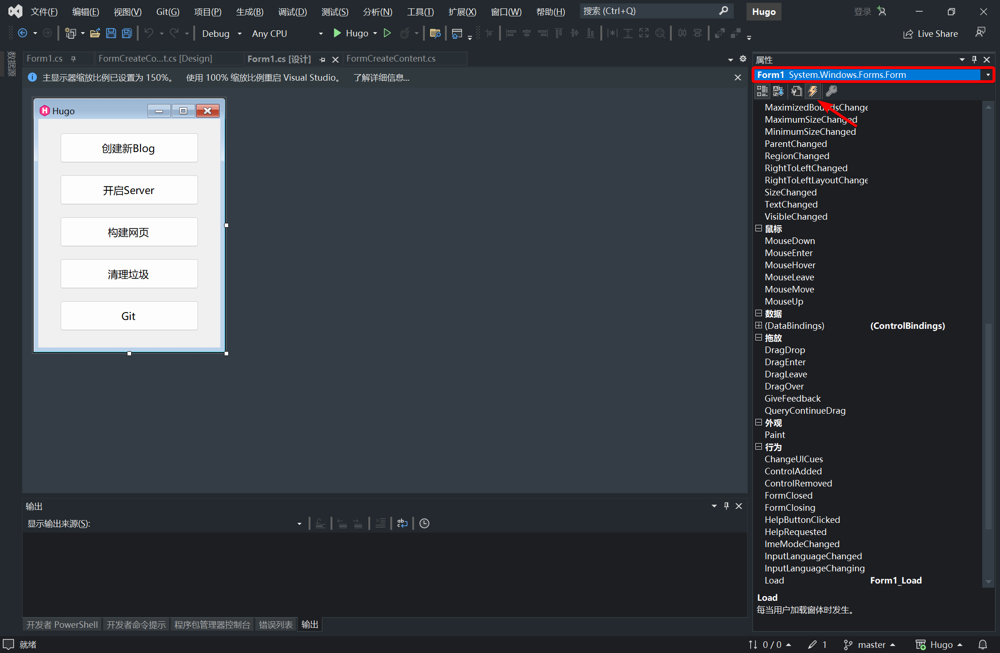

**最后编辑于2024年11月05日**

# 前言

这篇博客就是记录一些提醒自己（包括未来的自己😋）的tips

---

# 控件改(Name)，事件重新绑定

如上。以按钮为例，新建了一个button1，然后还没改名，不小心双击了，结果就直接新建Click事件了，这时候再改名的话，`form1.cs`里面Click事件还是`button1_Click`。

结论就是直接改成改名之后的事件名，这时候设计器肯定变成空白了，然后打开随便一个控件或者窗口，什么都行，的属性页，然后选到改动的那个按钮，更改Click事件的绑定函数就行。

如果设计器还是空白，那就关闭设计器，再打开，根据设计器的报错去设计文件里面更改事件绑定的函数就行。

---

参考

---
