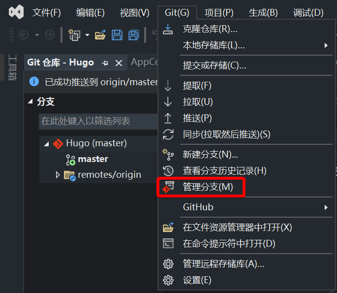
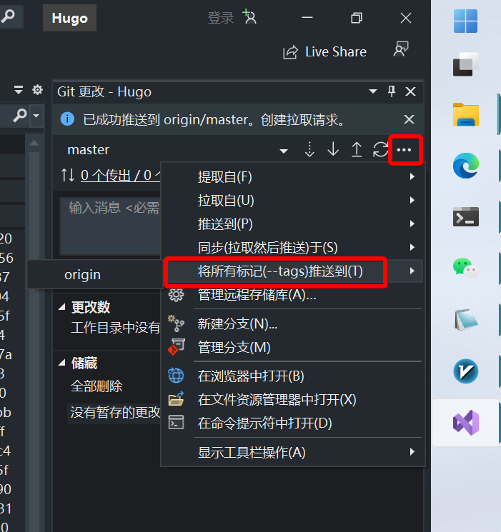

**最后编辑于2024年11月08日**

# 前言

我在GitHub启用了actions，其工作是检测到上传的tags是v开头时，自动构建并发布。但是刚开始不会在vs里面搞。现在搞明白了，记录一下。

---

# 打标签

打开位于vs顶栏的git - 管理分支，然后对某一个上传记录右键 - 新建标签。新建完成之后，打开顶栏的视图 - git更改，然后在git更改窗口的分支那一栏，打开右边的选项（三个点） - 将所有标签推送到 - origin。

# 参考

---

> [Visual Studio 2022 Git Push Tags](https://stackoverflow.com/questions/71379079/visual-studio-2022-git-push-tags)
