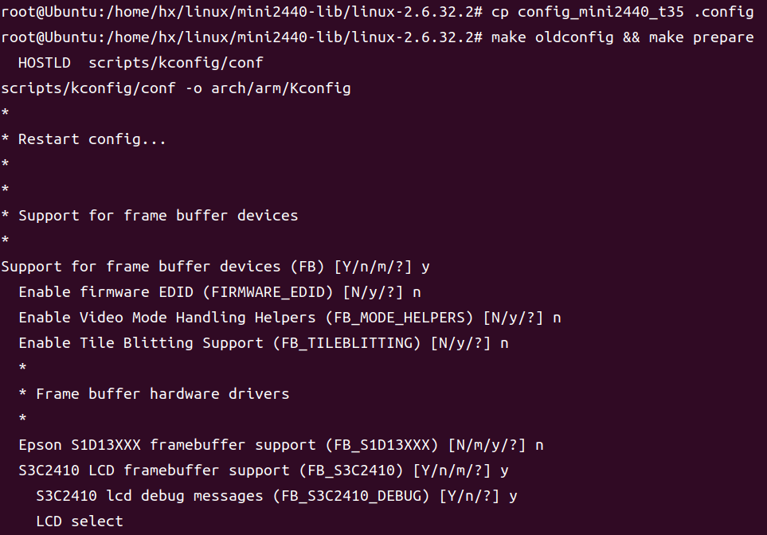
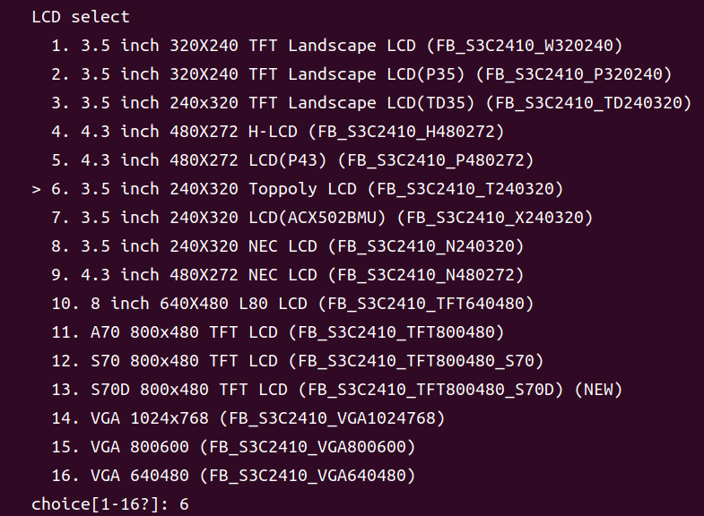
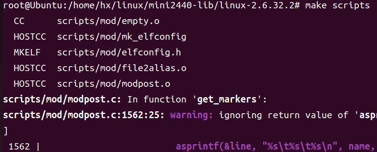

"编译mini2440的虚拟字符驱动"
date: 2024-11-10T01:36:15+08:00
description: "在虚拟机通过开发板的linux内核源码编译虚拟字符驱动模块"
tags: ["mini2440", "驱动", "编译"]
featured_image: ""
# images is optional, but needed for showing Twitter Card
images: []
categories: "课程学习"
comment: false
---

**最后编辑于2024年11月10日**

# 前言

嵌入式的第四次实验是编译一个虚拟字符驱动模块，我在学校电脑上可以编译成适合x86架构的版本，但是编译成开发板上的arm架构的就不行。

后来在自己的电脑上尝试了一下，在一些参考资料的帮助下，最终完成既定目标。现在记录一下。

虚拟机平台VBox，Ubuntu22.04。

---

# 配置编译环境

将资料里面的开发板linux源码`\FriendlyARM-2440-DVD\Linux\linux-2.6.32.2-mini2440-20150709.tgz`解压到虚拟机。

然后在解压目录下，将`mini2440_config_t35`复制为`.config`：

```sh
cp mini2440_config_t35 .config
```

然后执行下面的命令：

```sh
make oldconfig && make prepare
```



LCD就选择`6. 3.5 inch 240X230 Toppoly LCD (FB_S3C2410_T240320)`。



执行过程中如果出现有关`arm-linux-gcc`的报错，就去检测一下`arm-linux-gcc -v`有没有输出，没有就配置一下。

执行完成之后，再输入以下命令（这里有些报错是没问题的，只要都是warning就行）：

```sh
make scripts
```



执行完成就配置好了编译环境。

## 解释

`mini2440_config_t35`就是适合开发板屏幕的那个config文件，其实里面的`mini2440_config_`文件内容都相差不大，只有屏幕相关部分有差别。

将其复制为`.config`文件是为了设置内核配置信息，确保编译环境与开发板的实际情况相匹配。（其实这段话我是问AI的，我也不是很懂）

`make oldconfig`是为了查看是否有新的配置信息要处理，这里感觉没有什么用，但是网上都做了这个😋。

`make prepare`是为了准备之后编译要用到的文件和符号链接，以及处理一些依赖关系，以确保所需的工具和资源都已准备好。

`make scripts`是为了编译一些之后编译要用到的脚本文件。

---

# 更改驱动源码

原来的源码`chrdevbase.c`有些问题，头文件的引用并不对，需要改成下面的：

```c
#include <linux/kernel.h>
#include <linux/fs.h>
#include <linux/init.h>
#include <linux/module.h>
#include <linux/uaccess.h>
```

这里的引用我是复制老师发的[那篇CSDN博客](https://blog.csdn.net/weixin_46829095/article/details/128768229)的。

---

# 更改makefile.txt

这个文件内容也有些问题，改成下面的就行：

```makefile
KERNELDIR := /home/hx/linux/mini2440-lib/linux-2.6.32.2
ENV:=ARCH=arm CROSS_COMPILE=arm-none-linux-gnueabi-
obj-m := chrdevbase.o

all:
	$(MAKE) $(ENV) -C $(KERNELDIR) M=$(shell pwd) modules
clean:
	$(MAKE) $(ENV) -C $(KERNELDIR) M=$(shell pwd) clean
```

而且文件名也要改成Makefile，注意一定要大写M开头。

## 补充

后来发现上面的更改的添加的`ENV`不是必要的，这个只是用在编译的gcc版本和开发板的不对的时候用的，具体可以看[这里](https://blog.csdn.net/qq_41115702/article/details/104655050)。

---

# 编译及测试

在驱动源码目录下执行`make`即可，如果前面没有问题，那就可以看到`chrdevbase.ko`了。

后续的驱动测试就按参考一进行。

# 参考

---

> [嵌入式linux驱动开发-字符设备驱动](https://blog.csdn.net/qq_41753052/article/details/109138710)
>
> [加载驱动模块的两种方法](https://blog.csdn.net/qq_28576837/article/details/142790697)
>
> [linux make modules 命令详解](https://blog.csdn.net/weixin_42109053/article/details/124526066)
>
> [Linux驱动——编译驱动的两种形式（内核目录外、内核目录中）](https://blog.csdn.net/cha1290878789/article/details/121453401)
>
> [Linux驱动安装遇到的问题（Kernel configuration is invalid）（Invalid module format）](https://blog.csdn.net/Zander0/article/details/134871301)
> 
> [驱动编译错误 /bin/sh: scripts/mod/modpost](https://blog.csdn.net/u011202336/article/details/9172095)
> 
> [编译内核驱动模块出错（error: asm/xxx: No such file or directory）](https://blog.csdn.net/qq_41115702/article/details/104655050)
> 
> [Linux模块文件如何编译到内核和独立编译成模块？](https://blog.csdn.net/daocaokafei/article/details/115472862)
> 
